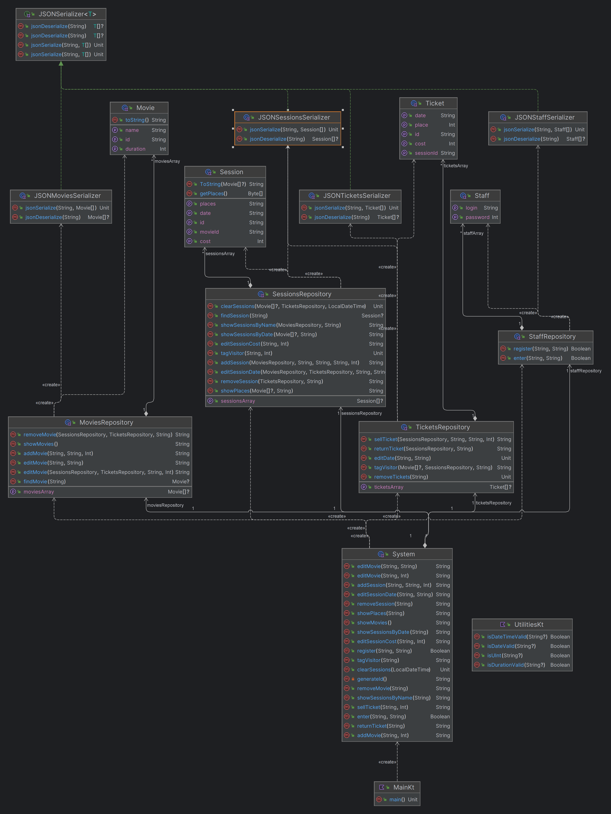

# Документация программы: 

## Как работает программа: 

1. При запуске приложения в консоли пользователю предлагается 1) войти или 2) зарегистрироваться 0) выйти из программы
1. Далее открывается основное меню, где предлагается:
   1) Поработать с фильмамии (после чего нужно ввести название фильма)
      1) Добавить фильм 
      2) Добавить сеанс 
      3) Редактировать название фильма 
      4) Редактировать длительность фильма 
      5) Удалить фильм 
      6) Показать сеансы (по фильму) 
      0) Вернуться к главному меню
   2) Поработать с сеансами (после чего нужно ввести дату и время сеанса)
      1) Продать билет 
      2) Редактировать дату сеанса 
      3) Редактировать цену сеанса 
      4) Удалить сеанс 
      5) Показ мест 
      0) Вернуться к главному меню
   3) Поработать с билетами (после чего нужно ввести id билета)
      1) Возврат билета 
      2) Отметить посещение 
      0) Вернуться к главному меню
   4) Показать все фильмы в каталоге
   5) Показать сеансы (по дате) 
   0) Выйти из программы

В каждом подпункте программа проинструктирует пользователя, что еще нужно ввести и в каком формате. 

## Особенности работы программы

* При каждом использовании одной из команд программы производится очистка закончившихся сеансов

* При добавлении фильма, происходит проверка на существование фильма с одинаковым названием. Если такой фильм уже существует, добавление не происходит
* При добавлении сеанса происходит проверка на дату и время сеанса. Если время показа добавляемого фильма не умещается в окна в расписании, то сеанс не добавляется
* При редактировании длительности фильма отменяются все существующие сеансы с ним и производится возврат проданных билетов
* При удалении фильма: если такого фильма не сущетсвует, ничего не происходит; вместе с фильмом удаляются все его сеансы (однако, если какой-то из сеансов уже идет, он продолжит идти
* При продаже билета производится проверка на наличие сеанса и свободного места под конкретным номером.
* При редактировании даты сеанса тоже проверяется на то, что он уже идет или нет, и новая дата тоже проверяется на занятость 
* При редактировании цены сеанса, уже проданные билеты остаются с той же ценой, а уже новые билеты будут продаваться по новой цене
* При возврате билета проверяется начался ли сеанс. Если сеанс начался то билет уже вернуть не получится
* Прийти на сеанс можно максимум за пятнадцать минут до начала

# Хранение данных

Данные хранятся в JSON файлах в папке data. Формат был выбран из-за доступности и удобства использования. 

# Диаграммы

